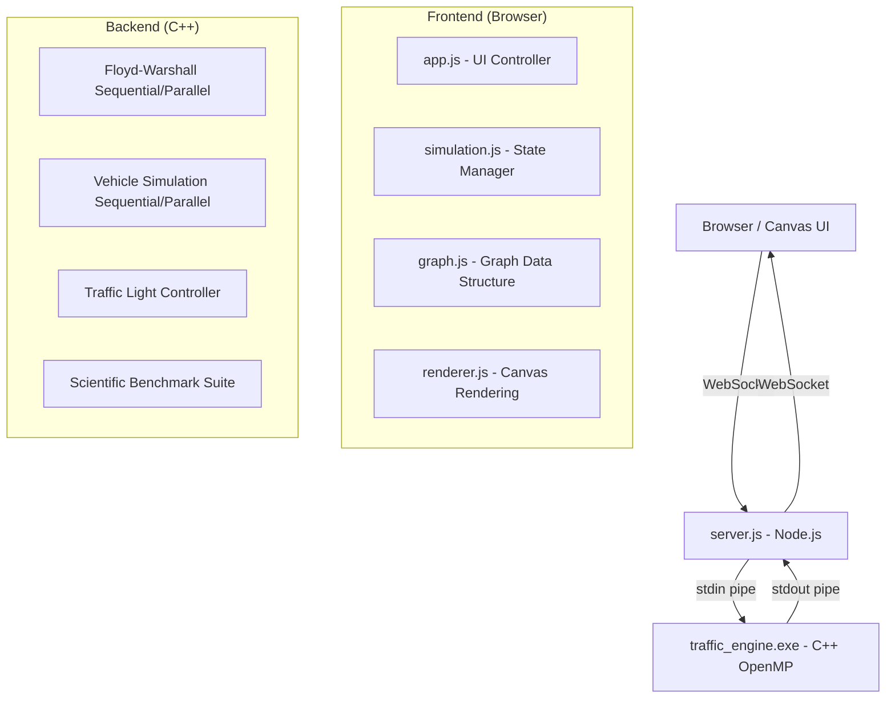

# 📘 CONCEPT_EXPLANATION — SmartCity Traffic Simulator (Hybrid C++ OpenMP Edition)

Dokumen ini menjelaskan **seluruh alur kerja (flow)**, **setiap menu pengaturan**, dan **setiap metrik yang ditampilkan** pada SmartCity Traffic Simulator secara mendetail. Disertai penjelasan perbedaan antar mode, dampak pengaturan, serta kelebihan dan kekurangan masing-masing opsi.

---

## Daftar Isi

1. [Arsitektur Sistem & Alur Kerja (Flow)](#1-arsitektur-sistem--alur-kerja-flow)
2. [Execution Mode: Sequential vs Parallel](#2-execution-mode-sequential-vs-parallel)
3. [Alokasi Thread (Worker Pool)](#3-alokasi-thread-worker-pool)
4. [Tick Interval](#4-tick-interval)
5. [Load Preset City Graph](#5-load-preset-city-graph)
6. [Vehicle Spawn](#6-vehicle-spawn)
7. [Tombol Kontrol Simulasi (Start, Pause, Resume, Stop, Reset)](#7-tombol-kontrol-simulasi)
8. [Live Metrics — Realtime Dashboard](#8-live-metrics--realtime-dashboard)
9. [Scientific Benchmark](#9-scientific-benchmark)
10. [Manual Graph Intervention & Data Export](#10-manual-graph-intervention--data-export)
11. [Fitur Tambahan: Presentation Mode, Zoom & Pan, Vehicle Selection](#11-fitur-tambahan)

---

## 1. Arsitektur Sistem & Alur Kerja (Flow)

### 1.1 Komponen Utama

Simulator ini memiliki **3 komponen utama** yang bekerja secara berlapis:

| Komponen | Teknologi | Tugas |
| :--- | :--- | :--- |
| **Frontend (Browser)** | HTML5 Canvas + JavaScript | Menampilkan visualisasi peta kota, kendaraan bergerak, dashboard metrik, dan menerima input pengguna |
| **Backend Server** | Node.js (`server.js`) | Menjembatani komunikasi antara browser dan mesin C++ melalui WebSocket ↔ stdin/stdout pipe |
| **Computation Engine** | C++ dengan OpenMP (`traffic_engine.exe`) | Menjalankan seluruh komputasi berat: algoritma Floyd-Warshall, pergerakan kendaraan, resolusi persimpangan |

### 1.2 Alur Kerja End-to-End (Flow Lengkap)

Berikut adalah urutan langkah dari awal hingga simulasi berjalan:

```
┌─────────────────────────────────────────────────────────────────┐
│                    FASE 1: INISIALISASI                         │
├─────────────────────────────────────────────────────────────────┤
│                                                                 │
│  1. User menjalankan `npm start`                                │
│     └─► server.js membuat HTTP server di port 3000              │
│                                                                 │
│  2. User membuka http://localhost:3000 di browser               │
│     └─► Browser memuat index.html, styles.css, dan js/app.js    │
│     └─► app.js membuat instance Simulation                      │
│     └─► Simulation membuat koneksi WebSocket ke server.js       │
│                                                                 │
│  3. server.js menerima upgrade WebSocket                        │
│     └─► server.js men-spawn traffic_engine.exe sebagai          │
│         child process                                           │
│     └─► stdin/stdout C++ dipasangkan ke WebSocket pipe          │
│                                                                 │
│  4. Default: Grid 7×7 di-generate di browser                    │
│     └─► 49 node dan 84 edge ditampilkan di Canvas               │
│                                                                 │
└─────────────────────────────────────────────────────────────────┘

┌─────────────────────────────────────────────────────────────────┐
│                    FASE 2: SETUP SIMULASI                       │
├─────────────────────────────────────────────────────────────────┤
│                                                                 │
│  5. User memilih Execution Mode (Sequential / Parallel)         │
│  6. User mengatur jumlah Thread (1–16)                          │
│  7. User mengatur Tick Interval (20ms–500ms)                    │
│  8. User memilih preset graph dan klik "Generate City Graph"    │
│     └─► Graph di-generate di browser (JS)                       │
│     └─► Data graph disimpan di SharedArrayBuffer                │
│                                                                 │
│  9. User memilih jumlah kendaraan dan klik "Spawn Vehicles"     │
│     a. Browser mengirim data graph ke C++ via WebSocket         │
│        (CLEAR_GRAPH → ADD_VERTEX → ADD_EDGE → BLOCK_ROAD)      │
│     b. Browser mengirim "CALCULATE_FW" ke C++                   │
│        └─► C++ menjalankan Floyd-Warshall (seq/parallel)        │
│        └─► C++ mengirim kembali matriks jarak & routing         │
│     c. Browser mengirim "SPAWN count seed" ke C++               │
│        └─► C++ membuat kendaraan dengan origin-destination      │
│            random dan rute terpendek (dari FW matrix)           │
│        └─► C++ mengirim kembali data kendaraan (posisi,         │
│            rute, kecepatan, tipe)                               │
│     d. Browser memuat data kendaraan ke memori dan              │
│        menampilkan di Canvas                                    │
│                                                                 │
└─────────────────────────────────────────────────────────────────┘

┌─────────────────────────────────────────────────────────────────┐
│                    FASE 3: EKSEKUSI SIMULASI                    │
├─────────────────────────────────────────────────────────────────┤
│                                                                 │
│  10. User klik "Start Simulation"                               │
│      └─► Status berubah menjadi RUNNING                         │
│      └─► Loop tick dimulai                                      │
│                                                                 │
│  11. Setiap interval tick (misal 50ms):                         │
│                                                                 │
│      a. Browser kirim "TICK_REQUEST mode threads tickRate"      │
│         ke C++ via WebSocket                                    │
│                                                                 │
│      b. C++ Engine menerima perintah:                           │
│         ├─ Update lampu lalu lintas di setiap persimpangan      │
│         │  (siklus merah/hijau setiap 40 tick, berbeda fase     │
│         │   per node)                                           │
│         ├─ Jalankan simulasi kendaraan:                         │
│         │  ├─ Sequential: satu loop for memproses semua         │
│         │  │  kendaraan satu per satu                           │
│         │  └─ Parallel: OpenMP membagi kendaraan ke             │
│         │     beberapa thread, tiap thread proses bagiannya     │
│         ├─ Untuk setiap kendaraan aktif:                        │
│         │  ├─ Hitung pergerakan: progress += (speed×dt)/weight  │
│         │  ├─ Cek apakah jalan terblokir → reroute otomatis    │
│         │  ├─ Cek lampu lalu lintas di persimpangan berikutnya  │
│         │  │  ├─ Merah → state = Waiting (delay 0.1s)          │
│         │  │  └─ Hijau → request crossing                     │
│         │  ├─ Cek apakah sudah sampai tujuan → state=Finished  │
│         │  └─ Update posisi X,Y untuk rendering                │
│         ├─ Resolusi persimpangan (siapa yang boleh lewat):      │
│         │  ├─ Sequential: array candidates[vertex]             │
│         │  └─ Parallel: per-thread candidates (lock-free)      │
│         │     lalu reduksi untuk memilih kendaraan prioritas    │
│         └─ Hitung waktu eksekusi dan sync overhead              │
│                                                                 │
│      c. C++ mengirim response JSON berisi:                      │
│         ├─ tickCount, exec_time, sync_overhead                  │
│         ├─ metrics (active, finished, waiting, stuck)           │
│         ├─ trafficLights[] (status lampu setiap node)           │
│         ├─ vehicleInts[] (state, posisi rute, dll)             │
│         └─ vehicleFloats[] (koordinat X/Y, kecepatan, dll)     │
│                                                                 │
│      d. Browser menerima data dan:                              │
│         ├─ Update TypedArray views di SharedArrayBuffer         │
│         ├─ Update dashboard metrik (throughput, progress, dll)  │
│         ├─ Canvas render loop (60fps) menggambar posisi         │
│         │  kendaraan yang sudah terupdate                       │
│         └─ Cek apakah semua kendaraan selesai → auto-stop      │
│                                                                 │
│  12. Simulasi selesai ketika semua kendaraan berstatus          │
│      Finished atau Stuck (active == 0)                          │
│                                                                 │
└─────────────────────────────────────────────────────────────────┘
```

### 1.3 Diagram Komunikasi WebSocket per Tick

```
Browser (Canvas UI)                 server.js              traffic_engine.exe
       │                               │                          │
       │──TICK_REQUEST parallel 4 50──►│                          │
       │                               │──"TICK_REQUEST ..."────►│
       │                               │                          │
       │                               │    [OpenMP memproses     │
       │                               │     ribuan kendaraan     │
       │                               │     secara paralel]      │
       │                               │                          │
       │                               │◄──JSON response─────────│
       │◄──WebSocket frame JSON────────│                          │
       │                               │                          │
       │  [Update canvas + dashboard]  │                          │
       │                               │                          │
```

---

## 2. Execution Mode: Sequential vs Parallel

### 2.1 Apa Itu Execution Mode?

Execution Mode menentukan **bagaimana komputasi dijalankan di dalam mesin C++**. Ada dua pilihan:

### 2.2 Sequential (Single-Thread)

```
Semua kendaraan diproses SATU PER SATU dalam satu loop oleh satu core CPU.
```

**Cara kerja:**
- Floyd-Warshall: Triple nested loop `k → i → j` dijalankan secara berurutan tanpa pembagian kerja.
- Vehicle Update: Satu `for` loop dari kendaraan ke-0 sampai ke-N diproses satu per satu.
- Resolusi persimpangan: Array `candidates[]` tunggal, langsung diisi dan diproses.

**Kelebihan:**
- ✅ Tidak ada overhead sinkronisasi antar thread
- ✅ Hasil deterministik (selalu sama persis setiap dijalankan)
- ✅ Mudah di-debug dan dipahami
- ✅ Cocok untuk graph kecil (≤50 node) di mana overhead paralel lebih besar dari manfaatnya

**Kekurangan:**
- ❌ Lambat untuk graph besar (Floyd-Warshall O(V³) menjadi sangat berat)
- ❌ Hanya memanfaatkan 1 core CPU, core lain menganggur
- ❌ Tidak scalable — waktu eksekusi meningkat linear dengan jumlah kendaraan

**Di mana pengaruhnya:**
- Waktu eksekusi Floyd-Warshall (FW Execution Time) lebih lama
- Vehicles Update Time lebih lama saat kendaraan banyak
- Synchronization Overhead selalu **0.00 ms** (karena tidak ada thread lain)
- Thread Monitor di dashboard menampilkan "Thread monitor inactive in Sequential Mode"

### 2.3 Parallel (Multi-Thread dengan OpenMP)

```
Pekerjaan DIBAGI ke beberapa thread CPU yang berjalan BERSAMAAN.
```

**Cara kerja Floyd-Warshall Paralel:**
```cpp
for (int k = 0; k < V; k++) {          // Loop K tetap sekuensial (dependensi data)
    #pragma omp parallel for schedule(dynamic)
    for (int i = 0; i < V; i++) {       // Loop I dibagi ke thread-thread
        for (int j = 0; j < V; j++) {   // Loop J diproses penuh per thread
            // update jarak terpendek
        }
    }
    // ← implicit barrier: semua thread selesai sebelum K berikutnya
}
```

**Cara kerja Vehicle Update Paralel:**
```cpp
#pragma omp parallel
{
    int tid = omp_get_thread_num();     // Setiap thread punya ID unik
    
    #pragma omp for schedule(static)
    for (int i = 0; i < totalVehicles; i++) {
        // Setiap thread hanya memproses sebagian kendaraan
        // Thread 0: kendaraan 0-249, Thread 1: kendaraan 250-499, dst
        
        // Gunakan thread_candidates[tid][vertex] untuk lock-free
    }
}

// Fase Reduksi (sekuensial):
// Gabungkan kandidat dari semua thread untuk tentukan siapa lewat
```

**Kelebihan:**
- ✅ **Jauh lebih cepat** untuk graph besar (250+ node)
- ✅ Memanfaatkan seluruh core CPU secara bersamaan
- ✅ Speedup bisa mencapai 2x–8x dibanding sequential
- ✅ Floyd-Warshall O(V³/P) di mana P = jumlah thread

**Kekurangan:**
- ❌ Ada **Synchronization Overhead** (waktu thread menunggu satu sama lain di barrier)
- ❌ Untuk graph kecil, overhead > manfaat (bisa lebih lambat dari sequential!)
- ❌ Hasil mungkin sedikit berbeda urutan prosesnya (non-deterministic ordering)
- ❌ Memori lebih banyak (setiap thread butuh array candidates sendiri)

**Di mana pengaruhnya:**
- FW Execution Time **jauh lebih cepat** untuk graph besar
- Vehicles Update Time **lebih cepat** saat kendaraan ≥500
- Synchronization Overhead menunjukkan **nilai > 0** (waktu idle thread menunggu barrier)
- Thread Monitor menampilkan status setiap worker thread (IDLE / FW COMPUTE / VEHICLE UPDATE)

### 2.4 Perbandingan Langsung

| Aspek | Sequential | Parallel |
| :--- | :--- | :--- |
| **Jumlah core CPU dipakai** | 1 | Sesuai alokasi thread (1–16) |
| **Floyd-Warshall 250 node** | ~50–100ms | ~10–30ms (4 thread) |
| **Overhead sinkronisasi** | 0 ms | 0.5–5 ms |
| **Cocok untuk graph** | Kecil (≤50 node) | Besar (≥100 node) |
| **Thread Monitor** | Tidak aktif | Aktif, menampilkan status per thread |
| **Contoh kasus terbaik** | Debug, demo sederhana | Stress test 500+ node, benchmark |

---

---

## 3. Alokasi Thread (Worker Pool)

### 3.0 Mengapa Paralelisme Dibutuhkan? (Analisis O(N³))

Sebelum membahas slider thread, penting memahami **mengapa** paralelisme dibutuhkan dari sudut pandang matematis:

**Floyd-Warshall All-Pairs Shortest Path (APSP)** memiliki kompleksitas waktu **kubik**:

$$T_{seq} = O(N^3) \quad \text{di mana } N = \text{jumlah simpul (vertex) kota}$$

| Ukuran Graf (N) | Jumlah Operasi Matriks | Estimasi Waktu (CPU 1 thread) |
|:---:|:---:|:---:|
| N = 49 (Grid 7×7) | ~117.649 ops | < 1 ms |
| N = 250 | ~15,6 juta ops | ~15–50 ms |
| N = 1.024 | ~1,07 miliar ops | ~1–5 detik |
| N = 2.048 | ~8,59 miliar ops | ~10–50 detik |

Pada N ≥ 512, komputasi sequential menjadi **bottleneck nyata** yang menyebabkan:
- UI Canvas **beku (freeze)** selama perhitungan berlangsung.
- Respons terhadap perubahan peta (blokir jalan, re-routing) menjadi sangat lambat.
- WebSocket pipe **blocked**, menyebabkan antrian tick menumpuk.

**Solusi:** Dengan P thread paralel, kompleksitas komputasi murni per thread terpangkas menjadi:
$$T_{par} \approx \frac{O(N^3)}{P}$$

### 3.1 Apa Itu Slider Alokasi Thread?

Slider **"Alokasi Thread"** mengatur berapa banyak **thread OpenMP** yang digunakan oleh mesin C++ saat mode Parallel aktif. Menggunakan skema diskrit pangkat dua: **2, 4, 8, dan 16 thread** (snapping slider). Hal ini bertujuan untuk:
- Meminimalkan **Load Imbalance** pada pengolahan graf biner (thread ganjil memecah partisi secara tidak rata).
- Memaksimalkan efisiensi pemrosesan paralel pada CPU multi-core.
- **Angka 1** tidak tersedia di slider paralel — gunakan dropdown **Sequential (Single-Thread)** untuk eksekusi 1-thread murni dan perbandingan baseline.

### 3.2 Cara Kerjanya

Saat user mengatur slider ke nilai N (dipetakan dari indeks slider 0–3 ke nilai [2, 4, 8, 16]):
1. Nilai `sim.numThreads = N` disimpan di frontend.
2. Setiap kali slider diubah, browser langsung memicu re-kalkulasi Floyd-Warshall secara *real-time* di backend C++.
3. Di C++, fungsi `omp_set_num_threads(N)` dipanggil sebelum region paralel.
4. OpenMP membagi loop ke N thread yang berjalan bersamaan di core fisik CPU.

**Dekomposisi Data (Data Decomposition):**
```
Untuk N=4 thread, matriks NxN dibagi menjadi 4 strip horizontal:
  Thread 0: baris 0 – N/4-1
  Thread 1: baris N/4 – N/2-1
  Thread 2: baris N/2 – 3N/4-1
  Thread 3: baris 3N/4 – N-1

Setiap thread membaca baris k (shared, read-only) dan menulis
baris-barisnya sendiri (private) → tidak ada race condition.
```

### 3.3 Pengaruh Pengaturan Rendah vs Tinggi

| Thread | Dampak | Kapan Cocok |
| :---: | :--- | :--- |
| **2 thread** | Pekerjaan dibagi 2, speedup ~1.5–1.8x pada graph besar. Overhead sinkronisasi minimal. | Graph menengah (50–150 node), laptop dual-core |
| **4 thread** | Sweet spot untuk kebanyakan CPU modern. Speedup ~2.5–3.5x pada N≥250. Balance antara percepatan dan overhead. | **Rekomendasi default.** Cocok untuk hampir semua skenario |
| **8 thread** | Speedup ~3–6x untuk graph besar. Selaras dengan jumlah **core fisik** AMD Ryzen 7 5700X. Optimal karena setiap core mengerjakan satu thread penuh. | Graph besar (250+ node), CPU 8-core |
| **16 thread** | Speedup bisa stagnan atau menurun (*diminishing returns*) akibat **Memory Bandwidth Bottleneck** dan **Synchronization Overhead** yang tinggi. | Hanya untuk eksperimen benchmark, CPU server |

### 3.4 Mengapa 16 Thread Bisa Lebih Lambat? (Memory Bandwidth Bottleneck)

Fenomena ini terjadi karena **dua mekanisme berlapis** pada arsitektur modern:

**A. SMT (Simultaneous Multi-Threading / Hyperthreading)**
```
CPU Ryzen 7 5700X:
  Core Fisik: 8
  Thread Logis (SMT): 16

Pada P=16, dua thread virtual berbagi:
  - Register fisik yang sama
  - Pipeline eksekusi yang sama
  - Cache L1 (32KB) dan L2 (512KB) yang sama per core
```

**B. Memory Bandwidth Bottleneck**
```
Matriks Floyd-Warshall berukuran N×N × 4 bytes (float):
  N=1024: 4 MB per matriks (dist + next)

Pada P=16 vs P=8:
  - Laju akses memori meningkat 2× → bandwidth DDR4 tersaturasi
  - Cache miss rate meningkat → latensi akses naik
  - Thread saling evict data dari cache L2/L3 satu sama lain
```

**C. Synchronization Overhead Berlipat**
```
Setiap iterasi K pada Floyd-Warshall membutuhkan barrier:
  #pragma omp barrier  ← semua thread menunggu di sini!

Dengan 16 thread, thread tercepat menunggu thread terlambat:
  Waktu tunggu ≈ max(T_thread) - min(T_thread)

Pada V=49: overhead barrier > waktu komputasi aktual
→ Speedup < 1 (lebih lambat dari sequential!)
```

**Hukum Amdahl (Batas Speedup Teoritis):**
```
S(P) = 1 / [f + (1-f)/P]

f = fraksi kode yang TIDAK bisa diparalelkan
    (loop K Floyd-Warshall, fase reduksi intersection, I/O)

Contoh nyata (f ≈ 30% karena overhead kecil V=49):
  S(2)  = 1/(0.30 + 0.70/2)  = 1.54x  → tapi overhead > benefit
  S(4)  = 1/(0.30 + 0.70/4)  = 2.11x  → masih kalah overhead
  S(8)  = 1/(0.30 + 0.70/8)  = 2.58x  → near Amdahl ceiling
  S(16) = 1/(0.30 + 0.70/16) = 2.84x  → marginal gain, overhead besar
```

### 3.5 Pengaruh di Dashboard

- **Worker Thread Activity Monitor**:
  - **2 atau 4 thread**: Menampilkan bar progress penuh per worker dengan label status (IDLE / FW COMPUTE / VEHICLE UPDATE).
  - **8 atau 16 thread**: Tampilan berubah otomatis ke **compact mini-grid** (4 kolom untuk 16T, 2 kolom untuk 8T) dengan animasi glow pulse yang berkedip real-time mengikuti aktivitas backend C++.
- **Synchronization Overhead**: Semakin banyak thread, nilai ini cenderung **lebih tinggi**.
- **FW Execution Time**: Semakin banyak thread (hingga sweet spot 8T), nilai ini cenderung **lebih rendah**.

---

## 4. Tick Interval

### 4.1 Apa Itu?

Slider **"Tick Interval"** mengatur **jeda waktu antar satu langkah simulasi ke langkah berikutnya** dalam milidetik. Rentang: **20ms sampai 500ms**.

### 4.2 Cara Kerjanya

```
Tick Interval = 50ms berarti:
    - Setiap 50ms, browser mengirim TICK_REQUEST ke C++
    - C++ menghitung pergerakan kendaraan selama dt = 50/1000 = 0.05 detik
    - Kendaraan bergerak sejauh: progress += (speed × 0.05) / weight
```

Tick interval mempengaruhi **dua hal sekaligus**:
1. **Seberapa sering** simulasi di-update (frekuensi)
2. **Seberapa jauh** kendaraan bergerak per step (delta time)

### 4.3 Perbandingan Rendah vs Tinggi

| Tick Interval | Frekuensi Update | Delta Time (dt) | Efek Visual | Efek Komputasi |
| :---: | :--- | :--- | :--- | :--- |
| **20ms** (minimum) | 50 update/detik | 0.02s per step | Sangat halus & mulus, kendaraan bergerak perlahan per step | Beban CPU **sangat tinggi** — C++ dipanggil 50x per detik |
| **50ms** (default) | 20 update/detik | 0.05s per step | Mulus, balance bagus | Beban CPU **moderat** — rekomendasi |
| **100ms** | 10 update/detik | 0.10s per step | Mulai terasa "tersentak-sentak" | Beban CPU **ringan** |
| **200ms** | 5 update/detik | 0.20s per step | Kendaraan melompat-lompat | Beban CPU **sangat ringan** |
| **500ms** (maximum) | 2 update/detik | 0.50s per step | Kendaraan melompat jauh per step, animasi sangat patah-patah | Beban CPU **minimal** |

### 4.4 Kapan Menggunakan Apa?

- **20–50ms**: Untuk presentasi/demo di mana visual halus penting
- **50–100ms**: Default terbaik untuk analisis dan penggunaan normal
- **200–500ms**: Untuk stress test graph besar (500+ node, 5000+ kendaraan) agar browser tidak kewalahan menerima data

### 4.5 Catatan Penting

- Tick interval **TIDAK mempengaruhi kecepatan simulasi secara total** — kendaraan tetap menempuh jarak yang sama, hanya resolusi waktu yang berbeda
- Tick interval 20ms dengan 10.000 kendaraan bisa membuat browser lag karena data JSON yang dikirim sangat besar dan sering
- Canvas render loop tetap 60fps terlepas dari tick interval (rendering dan simulasi terpisah)

---

## 5. Load Preset City Graph

### 5.1 Apa Itu?

Menu **"Load Preset City Graph"** menyediakan **topologi peta kota siap pakai** dengan berbagai pola jalan. Setiap preset menghasilkan jumlah node (persimpangan) dan edge (jalan) yang berbeda.

### 5.2 Daftar Mode dan Perbedaannya

---

#### 🟦 Grid Pattern (49 Nodes, 84 Edges)

**Deskripsi:** Peta berbentuk kotak-kotak 7×7, seperti kota Manhattan/blok perkotaan modern.

**Struktur:**
```
 0 ─── 1 ─── 2 ─── 3 ─── 4 ─── 5 ─── 6
 │     │     │     │     │     │     │
 7 ─── 8 ─── 9 ───10 ───11 ───12 ───13
 │     │     │     │     │     │     │
14 ───15 ───16 ───17 ───18 ───19 ───20
 ...  (sampai node 48)
```

- Setiap node terhubung ke tetangga kanan dan bawah (bidirectional)
- Bobot jalan: random antara 50–100
- Graph Density: ~7.1%
- Average Degree: ~3.43

| Kelebihan | Kekurangan |
| :--- | :--- |
| ✅ Terstruktur rapi, mudah dibaca | ❌ Tidak realistis — kota nyata tidak simetris |
| ✅ Routing merata, tidak ada bottleneck | ❌ Terlalu kecil untuk benchmark paralel |
| ✅ Cocok untuk belajar dan demo awal | ❌ Kurang menantang untuk analisis kemacetan |
| ✅ Cepat di-generate dan di-render | ❌ Hanya 49 node — perbedaan seq vs par kecil |

**Fungsi utama:** Demo dasar, belajar konsep, presentasi sederhana.

---

#### 🟢 Ring Road Pattern (61 Nodes, ~65 Edges)

**Deskripsi:** Peta berbentuk lingkaran konsentris, seperti kota Eropa dengan ring road.

**Struktur:**
```
             ╭── Ring 3 (luar) ──╮
         ╭── Ring 2 (tengah) ──╮ │
     ╭── Ring 1 (dalam) ──╮   │ │
     │      Center ●       │   │ │
     ╰─────────────────────╯   │ │
         ╰─────────────────────╯ │
             ╰───────────────────╯
```

- 1 node pusat + 3 ring, masing-masing 20 node
- Ring dihubungkan secara radial (pusat → ring 1, ring 1 → ring 2, ring 2 → ring 3)
- Dalam ring: setiap node terhubung ke node berikutnya (circular linked list)

| Kelebihan | Kekurangan |
| :--- | :--- |
| ✅ Struktur hierarkis, menarik secara visual | ❌ Bottleneck di node pusat |
| ✅ Menunjukkan pola kemacetan konsentris | ❌ Konektivitas terbatas — banyak rute panjang |
| ✅ Realistis untuk kota berbasis ring road | ❌ Mudah terjadi "stuck" jika jalan radial diblokir |
| ✅ Bagus untuk demo traffic light dan antrean | ❌ Degree tidak merata (pusat vs pinggir) |

**Fungsi utama:** Analisis bottleneck, demo congestion di pusat kota, studi pola radial.

---

#### 🟠 High Density Core (120 Nodes, ~280 Edges)

**Deskripsi:** Peta acak berdensitas tinggi, seperti pusat kota metropolitan yang padat.

**Struktur:**
- 120 node ditempatkan secara random dalam radius 250px dari pusat
- Setiap node terhubung ke **tetangga terdekat** (menjamin graph terhubung / connected)
- Ditambah edge acak dengan probabilitas 8% untuk node berjarak < 150px
- Bobot dihitung dari jarak Euclidean / 2

| Kelebihan | Kekurangan |
| :--- | :--- |
| ✅ Realistis — menyerupai jalan kota nyata | ❌ Layout bisa berantakan/tumpang tindih |
| ✅ Cukup besar untuk melihat perbedaan seq vs par | ❌ Kurang terstruktur — sulit dinavigasi visual |
| ✅ Pola kemacetan organik dan natural | ❌ Waktu Floyd-Warshall mulai terasa (~20ms) |
| ✅ Cocok untuk analisis congestion serius | ❌ Bisa terlalu padat di pusat |

**Fungsi utama:** Simulasi realistis, analisis kemacetan, perbandingan mode seq vs par.

---

#### 🔴 Stress Test (50 / 250 / 500 / 1000 Nodes)

**Deskripsi:** Graph random besar untuk menguji batas performa sistem.

| Preset | Nodes | Perkiraan Edges | Edge Probability | Waktu FW (Seq) | Waktu FW (4T Par) |
| :--- | :---: | :---: | :---: | :--- | :--- |
| Stress Test Mini (50) | 50 | ~100 | 5% | <5ms | <5ms |
| Stress Test Medium (250) | 250 | ~800 | 5% | ~50–100ms | ~15–30ms |
| Stress Test Large (500) | 500 | ~2500 | 2% | ~500–1000ms | ~150–300ms |
| Stress Test Extreme (1000) | 1000 | ~10000 | 2% | ~5000–15000ms | ~1500–4000ms |

| Kelebihan | Kekurangan |
| :--- | :--- |
| ✅ Menunjukkan **perbedaan dramatis** seq vs par | ❌ Visualisasi menjadi sangat padat/ramai |
| ✅ Data benchmark yang bermakna secara ilmiah | ❌ FW 1000 node bisa memakan waktu 15+ detik |
| ✅ Menguji batas scalability OpenMP | ❌ Browser bisa lag jika kendaraan banyak |
| ✅ Ideal untuk laporan perbandingan performa | ❌ Tidak cocok untuk demo/presentasi visual |

**Fungsi utama:** Benchmark performa, laporan akademik, uji scalability paralelisme.

---

## 6. Vehicle Spawn

### 6.1 Apa Itu?

Menu **"Vehicle Spawn Setup"** menentukan **berapa banyak kendaraan** yang akan di-generate dan disimulasikan di peta kota.

### 6.2 Proses Spawn

Ketika user klik "Spawn Vehicles":
1. **Floyd-Warshall** dijalankan dulu untuk menghitung rute terpendek semua pasangan node
2. Setiap kendaraan diberi:
   - **Origin** (titik asal): node random
   - **Destination** (titik tujuan): node random berbeda dari origin
   - **Rute**: jalur terpendek dari origin ke destination (dari matriks FW)
   - **Tipe**: Mobil (60%), Motor (30%), Bus (10%)
   - **Kecepatan**: Mobil ~50, Motor ~70, Bus ~30 (±10% variasi)

### 6.3 Tipe Kendaraan

| Tipe | Probabilitas | Kecepatan Dasar | Ukuran Visual | Warna |
| :--- | :---: | :---: | :--- | :--- |
| 🚗 Mobil | 60% | 50 px/s | Sedang (11×6.5) | Biru Langit |
| 🏍 Motor | 30% | 70 px/s | Kecil (7.5×3.5) | Amber/Kuning |
| 🚌 Bus | 10% | 30 px/s | Besar (18×8.5) | Pink |

### 6.4 Pengaruh Jumlah Kendaraan

| Jumlah | Label | Dampak pada Simulasi | Dampak pada Performa |
| :---: | :--- | :--- | :--- |
| **100** | Light Load | Sedikit kemacetan, kendaraan lancar. Throughput tinggi. | CPU dan browser ringan. Perbedaan seq vs par **hampir tidak terasa**. |
| **500** | Medium Load | Mulai terjadi antrean di beberapa persimpangan. Congestion density ~5–15%. | Vehicles Update Time mulai terasa. Perbedaan seq vs par **terlihat**. |
| **1,000** | Heavy Load | Kemacetan signifikan. Banyak kendaraan menunggu di persimpangan. Heatmap berubah oranye-merah. | Vehicles Update Time meningkat nyata. **Parallel mode 2–3x lebih cepat** dari sequential. |
| **5,000** | Stress Test | Kemacetan berat di hampir semua jalan. Banyak kendaraan stuck. Throughput menurun. | Beban tinggi. Browser mulai terasa berat (JSON per tick sangat besar). LOD mode aktif (kendaraan digambar sebagai titik). |
| **10,000** | Extreme | Gridlock total di graph kecil. Hanya efektif di graph 500+ node. | Beban sangat berat. **Hanya disarankan untuk benchmark** dengan tick interval 200ms+. |

### 6.5 Tips

- **100–500 kendaraan** untuk demo dan presentasi
- **1000 kendaraan** untuk melihat perbedaan seq vs par secara nyata
- **5000+ kendaraan** hanya untuk benchmark dengan graph besar dan tick interval tinggi
- Jika kendaraan lebih banyak dari node, banyak yang akan tersangkut di persimpangan (realistis!)

---

## 7. Tombol Kontrol Simulasi

| Tombol | Fungsi | Kapan Aktif |
| :--- | :--- | :--- |
| ▶ **Start** | Memulai simulasi. Menjalankan loop tick. | Saat status STOPPED dan kendaraan sudah di-spawn |
| ⏸ **Pause** | Menghentikan sementara loop tick. Kendaraan berhenti. | Saat status RUNNING |
| ▶ **Resume** | Melanjutkan simulasi dari posisi terakhir. | Saat status PAUSED |
| ⏹ **Stop** | Menghentikan simulasi total. | Saat RUNNING atau PAUSED |
| 🔄 **Reset** | Menghapus semua kendaraan dan mereset tick ke 0. Graph tetap ada. | Kapan saja |

---

## 8. Live Metrics — Realtime Dashboard

Dashboard terbagi menjadi beberapa bagian yang masing-masing menampilkan informasi berbeda:

### 8.1 Realtime Dashboard (Header)

| Metrik | Penjelasan | Contoh |
| :--- | :--- | :--- |
| **Time** | Waktu simulasi = tickCount × (tickRate / 1000) | `12.5s` = 250 tick × 50ms |
| **Journey Progress** | Persentase kendaraan yang sudah sampai tujuan = (finished / total) × 100% | `67%` berarti 67% kendaraan sudah selesai perjalanan |

### 8.2 Vehicle Status Distribution

Bar visual yang menunjukkan proporsi status seluruh kendaraan:

| Status | Warna | Arti |
| :--- | :--- | :--- |
| **Moving** | 🟦 Biru | Kendaraan sedang bergerak di jalan |
| **Waiting** | 🟩 Hijau | Kendaraan menunggu (lampu merah atau antri crossing) |
| **Stuck** | 🟥 Merah | Kendaraan tidak bisa melanjutkan (jalan terblokir dan tidak ada rute alternatif) |
| **Finished** | 🟣 Ungu | Kendaraan sudah sampai tujuan |

### 8.3 Metrik Angka

| Metrik | Penjelasan |
| :--- | :--- |
| **Tick Count** | Jumlah total langkah simulasi yang sudah dieksekusi |
| **Live Throughput** | Kendaraan yang *selesai per detik* pada tick saat ini = finishedThisTick / dt |
| **Active Vehicles** | Jumlah kendaraan yang masih bergerak atau menunggu (belum finished/stuck) |
| **Completed Journey** | Total kendaraan yang sudah sampai tujuan |

### 8.4 Congestion Summary

| Metrik | Cara Hitung | Arti |
| :--- | :--- | :--- |
| **Avg Traffic Density** | Rata-rata (kendaraan di edge / kapasitas edge) untuk semua edge aktif × 100% | Semakin tinggi = semakin macet secara keseluruhan |
| **Most Congested Edge** | Edge (jalan) dengan jumlah kendaraan terbanyak | Misalnya `12 ➔ 13` = jalan dari node 12 ke 13 paling padat |
| **Busiest Intersection** | Node dengan kendaraan terbanyak yang sedang menunggu (state = Waiting) | Misalnya `Intersection #17` = persimpangan 17 paling sibuk |

### 8.5 City Graph Statistics

| Metrik | Penjelasan |
| :--- | :--- |
| **Nodes / Edges** | Jumlah persimpangan aktif / jumlah jalan (directed) |
| **Graph Density** | Persentase dari seluruh kemungkinan edge yang benar-benar ada = E / (V × (V-1)) × 100% |
| **Avg Vertex Degree** | Rata-rata jumlah jalan per persimpangan = E / V |
| **Blocked Roads** | Jumlah jalan yang sedang ditutup/diblokir |

### 8.6 Worker Thread Activity Monitor

**Hanya aktif di mode Parallel.** Menampilkan status setiap worker thread OpenMP:

| Status Thread | Warna | Arti |
| :--- | :--- | :--- |
| **IDLE** | ⚪ Abu-abu | Thread tidak sedang bekerja |
| **FW COMPUTE** | 🔵 Indigo | Thread sedang menghitung Floyd-Warshall |
| **VEHICLE UPDATE** | 🟢 Hijau | Thread sedang memproses pergerakan kendaraan |

Di mode Sequential, area ini menampilkan: *"Thread monitor inactive in Sequential Mode."*

### 8.7 Metrik Waktu Eksekusi

| Metrik | Penjelasan |
| :--- | :--- |
| **FW Execution Time** | Waktu yang dibutuhkan C++ untuk menjalankan Floyd-Warshall terakhir (dalam ms) |
| **Vehicles Update Time** | Waktu yang dibutuhkan C++ untuk memproses pergerakan semua kendaraan dalam 1 tick (dalam ms) |
| **Synchronization Overhead** | Waktu yang terbuang karena thread menunggu satu sama lain di barrier/sinkronisasi (hanya di mode Parallel) |

**Cara membaca:**
- Jika FW Time di Parallel **jauh lebih kecil** dari Sequential → OpenMP efektif
- Jika Sync Overhead **mendekati** Vehicles Update Time → terlalu banyak thread (diminishing returns)
- Jika Sync Overhead **= 0** → mode Sequential (tidak ada sinkronisasi)

---

## 9. Scientific Benchmark

### 9.1 Apa Itu?

Tab **"Scientific Benchmark"** menjalankan pengujian performa ilmiah yang terisolasi di mesin C++ untuk mengukur speedup paralelisme secara akurat.

### 9.2 Cara Kerjanya

1. C++ membuat graph **khusus benchmark** (250 node, random connected) — terpisah dari graph simulasi
2. Floyd-Warshall dijalankan **3 kali** secara sequential, hasilnya dirata-ratakan
3. Floyd-Warshall dijalankan **3 kali** untuk setiap konfigurasi thread (1, 2, 4, 8, 16), hasilnya dirata-ratakan
4. Graph simulasi **di-restore** ke kondisi sebelum benchmark (benchmark tidak mengubah state)
5. Hasil dikirim kembali ke browser untuk divisualisasikan

### 9.3 Metrik yang Ditampilkan

#### Summary Cards

| Card | Penjelasan |
| :--- | :--- |
| **Sequential Baseline** | Waktu eksekusi rata-rata FW sekuensial murni (dalam ms) |
| **Best Parallel Time** | Waktu eksekusi FW paralel terbaik dari semua konfigurasi thread |
| **Peak Speedup** | Rasio: Sequential / Best Parallel. Misalnya 3.2x berarti 3.2 kali lebih cepat |
| **Peak Efficiency** | (Speedup / jumlah thread) × 100%. Misalnya Speedup 3.2x di 4 thread = 80% |

#### Chart 1: Execution Time (ms vs Threads)

- Garis merah putus-putus: baseline sequential
- Garis biru: waktu paralel untuk setiap konfigurasi thread
- **Interpretasi**: Garis biru semakin rendah = semakin cepat

#### Chart 2: Speedup (Sx vs Threads)

- Mengukur percepatan dibanding baseline: `S(P) = T_seq / T_par(P)`
- Garis diagonal putus-putus: speedup linear ideal (1x, 2x, 4x, ...)
- **Interpretasi**: Semakin mendekati garis ideal = paralelisme semakin efisien

#### Chart 3: Efficiency (% vs Threads)

- Efisiensi = `S(P) / P × 100%`
- 100% = sempurna (setiap thread berkontribusi penuh)
- **Interpretasi**: Efisiensi menurun saat thread bertambah karena overhead

#### Analisis Hukum Amdahl

Teks analisis otomatis yang menjelaskan:
- **Fraksi serial (f)**: Persentase kode yang tidak bisa diparalelkan. Dihitung dari speedup 4 thread.
- **Sync overhead**: Waktu rata-rata sinkronisasi pada konfigurasi thread puncak
- **Kesimpulan**: Mengapa speedup tidak linear, apa yang membatasi performa

---

## 10. Manual Graph Intervention & Data Export

### 10.1 Manual Graph & Topology Editing

Selain pemblokiran jalan dinamis, sistem ini mendukung **Interactive Graph Editing** penuh yang memungkinkan pengguna untuk merestrukturisasi peta kota secara *real-time* saat simulasi sedang dihentikan (*paused/stopped*).

#### 🖱️ Kontrol Edit Mode
Pengguna dapat memilih salah satu mode pengeditan berikut dari panel **Graph Edit Mode** di sidebar kanan:

| Mode | Cara Penggunaan | Dampak Sistem & Sinkronisasi |
| :--- | :--- | :--- |
| **Select Mode** | • Klik pada jalan untuk memblokir/membuka jalan.<br>• Klik kendaraan untuk menyoroti jalurnya. | Mengubah status segment menjadi `blocked`. Memicu kalkulasi ulang matriks rute FW. |
| **➕ Add Node** | Klik pada area kosong canvas (minimal berjarak 25px dari node lain). | Menambahkan persimpangan (*vertex*) baru pada graf. ID node baru otomatis dialokasikan dari slot kosong pertama. |
| **❌ Remove Node** | Klik pada node yang ingin dihapus. Setujui konfirmasi pada modal. | Menghapus persimpangan beserta **seluruh jalan terhubung** (*incident edges*). Memicu rerouting instan bagi kendaraan terdampak. |
| **➕ Add Road** | Klik node asal, lalu klik node tujuan. Atur bobot & tipe arah pada modal. | Menghubungkan dua persimpangan dengan jalan baru (Satu Arah atau Dua Arah). Menghitung ulang rute FW. |
| **❌ Remove Road** | Klik pada segmen jalan yang ingin dihapus. Setujui konfirmasi modal. | Menghapus jalan penghubung secara permanen. Memicu kalkulasi ulang FW dan rerouting kendaraan. |

#### ⚙️ Mekanisme Sinkronisasi & Dynamic Rerouting Backend C++
Setiap kali topologi graf dimodifikasi di frontend (penambahan/penghapusan node atau jalan):
1. **Pembaruan Memori Lokal JS**: Struktur graf di memori web diperbarui.
2. **Kalkulasi Shortest Path Paralel**: Frontend mengirimkan sinyal pembaruan graf ke backend C++. Program backend menghapus matriks lama, memuat topologi baru, lalu mengeksekusi algoritma **Floyd-Warshall (Sequential/Parallel)** untuk memperbarui matriks pencarian rute terpendek (`fwDistance` dan `fwNext`).
3. **Dynamic Rerouting Tanpa Teleportasi**: Fungsi backend `rerouteActiveVehicles()` secara paralel (menggunakan OpenMP) mendeteksi kendaraan aktif yang jalurnya terputus atau berubah. Rute perjalanan mereka dihitung ulang secara dinamis mulai dari target node berikutnya ke destinasi tujuan akhir tanpa efek lompatan (*teleportation*).
4. **Dashboard Metrics Update**: Statistik jumlah node, edge, kerapatan graf (*graph density*), rata-rata derajat vertex (*average vertex degree*), dan status kemacetan langsung diperbarui secara *real-time*.

#### 🛠️ Fitur Tambahan & Bug Fixes Presentasi
- **Visual Feedback & Canvas Preview**: Saat menghubungkan jalan baru, garis putus-putus kuning tipis akan mengikuti kursor mouse dari node asal yang berdenyut (pulsing cyan ring). Node/jalan yang disorot akan memiliki efek bersinar/highlight merah atau amber.
- **Monitor Ultrawide (Aspect Ratio Scaling)**: Input koordinat canvas dikonversi secara dinamis terhadap rasio resolusi internal `800x600` dengan ukuran display CSS. Mencegah bug misclick pada resolusi layar ultrawide (seperti 2560x1080).
- **Jitter Protection**: Ambang batas drag ditingkatkan ke 5px untuk mencegah getaran kecil mouse membatalkan klik di canvas.
- **Congestion Display Hold**: Ketika simulasi selesai, data puncak kemacetan terakhir tetap ditahan di dashboard (tidak langsung riset ke 0) agar memudahkan proses presentasi hasil simulasi kepada dosen penguji.

### 10.2 Data Export Modules

| Tombol | Fungsi | Format File & Rincian Data |
| :--- | :--- | :--- |
| **Export Journey CSV** | Mengunduh data perjalanan seluruh kendaraan dan tabel perbandingan kinerja multithreading. | **.csv** terbagi menjadi dua bagian:<br>1. **Computational Performance Table**: Data waktu eksekusi Floyd-Warshall yang di-generate via benchmark instan saat tombol diklik. Membaca skenario genap pangkat dua: **2, 4, 8, dan 16 thread**. Dilengkapi proteksi hardware: jika thread melebihi batas logic CPU, skenario dilewati aman (`0.0ms`) tanpa membuat sistem freeze.<br>2. **Vehicle Journey Statistics**: Menggunakan data riil hasil rekaman simulasi aktif (Live Session) tanpa simulasi terisolasi tambahan. Menjamin kejujuran data perjalanan di hadapan penguji. |
| **Export Graph JSON** | Mengunduh konfigurasi graph yang sedang dimodifikasi secara real-time. | **.json** berisi: koordinat node (id, x, y), status bobot (*road weight*) yang di-update, serta status pemblokiran jalan (*blocked/unblocked*). Menjamin topologi yang diekspor 100% mewakili modifikasi interaktif pengguna. |

---

## 11. Fitur Tambahan

### 11.1 Presentation Mode

Toggle **🎭 Presentation Mode** mengaktifkan mode visual yang lebih menarik untuk presentasi di layar besar:

| Aspek | Normal Mode | Presentation Mode |
| :--- | :--- | :--- |
| Ukuran node | 11px radius | 14px radius |
| Ukuran kendaraan | Standar | Lebih besar |
| Glow effect | Tidak ada | Shadow glow pada node |
| Road width | 2px | 3.5px |
| Headlamp beam | Tidak ada | Cahaya kuning di depan kendaraan |
| HUD overlay | Ukuran kecil | Diperbesar 15% |

### 11.2 Zoom & Pan

| Kontrol | Fungsi |
| :--- | :--- |
| **🔍+ Zoom In** | Memperbesar tampilan (max 400%) |
| **🔍- Zoom Out** | Memperkecil tampilan (min 45%) |
| **⊞ Fit** | Mengembalikan tampilan ke posisi default, auto-center ke graph |
| **Drag Mouse** | Geser tampilan dengan klik-dan-seret di Canvas |

### 11.3 Vehicle Selection

Klik kendaraan di Canvas untuk menampilkan:
- **Info HUD** di pojok kiri bawah (tipe, kecepatan, travel time, progress)
- **Route highlight** — jalur sisa perjalanan ditandai garis cyan berkedip (ant marching animation)
- Klik area kosong untuk deselect

### 11.4 Traffic Light System

Setiap persimpangan memiliki lampu lalu lintas otomatis:
- Siklus: 20 tick hijau → 20 tick merah (total siklus 40 tick)
- Setiap node **berbeda fase** (offset = node_id × 5) sehingga tidak semua lampu merah bersamaan
- Visual: border node hijau = lampu hijau, border merah = lampu merah
- Kendaraan yang tiba saat merah → menunggu 0.1 detik, lalu cek lagi

### 11.5 Heatmap Congestion

Jalan otomatis berubah warna berdasarkan kepadatan kendaraan:

| Kepadatan | Warna Glow | Arti |
| :---: | :--- | :--- |
| 0–5% | Tidak ada glow | Lancar |
| 5–20% | 🟢 Hijau transparan | Lancar dengan sedikit kendaraan |
| 20–60% | 🟡 Kuning/Amber | Mulai padat |
| 60–90% | 🟠 Oranye | Padat, kendaraan mulai melambat |
| 90–100% | 🔴 Merah | Macet total (gridlock) |

### 11.6 Level of Detail (LOD)

Saat kendaraan aktif > 2000 dan Presentation Mode OFF:
- Kendaraan digambar sebagai **titik kecil** (3.5px) bukan bentuk oriented
- Heatmap glow **dimatikan**
- Label bobot jalan **disembunyikan**
- Tujuan: menjaga frame rate 60fps meskipun banyak kendaraan

### 11.7 Dynamic Rerouting

Saat jalan diblokir di tengah simulasi:
- Matriks Floyd-Warshall **dihitung ulang** secara otomatis
- Kendaraan yang sedang di jalan terblokir akan **mencari rute alternatif** menggunakan matriks baru
- Jika tidak ada rute → kendaraan menjadi Stuck
- Ini mensimulasikan **navigasi GPS real-time** yang merespons penutupan jalan

---

## Ringkasan Arsitektur



---

---

## 12. Peningkatan Fitur & Analisis HPC (Revisi UAS)

Berikut adalah detail konseptual mengenai fitur-fitur baru dan analisis performa High-Performance Computing (HPC) yang diterapkan pada sistem ini:

### 12.1 Logika Reset Simulasi
Pada logika reset yang diperbarui:
1. **Pemberhentian & Waktu:** Loop `TICK_REQUEST` segera dihentikan (`state = "stopped"`). `tickCount` dikembalikan ke `0`, sehingga waktu visual di dasbor menampilkan `0.0s`.
2. **Preservasi Rute & Kendaraan:** Berbeda dengan `clearVehiclesMemory()` yang menghapus seluruh data kendaraan, reset ini mempertahankan jumlah kendaraan (`totalVehicles`) beserta rute aslinya (`vehiclePaths`).
3. **Restorasi Posisi:** Setiap kendaraan dikembalikan ke posisi asal keberangkatannya (simpul origin). Progress pergerakan di-reset menjadi `0.0f` dan statusnya dikembalikan ke `1` (Moving). Hal ini meminimalkan overhead *re-routing* saat simulasi dijalankan ulang oleh pengguna.

### 12.2 Konsep Desain Peta Manual (Blank Canvas)
Fitur **Blank Canvas** memicu pembersihan graf total tanpa memuat simpul atau sisi bawaan. Pengguna memulai dengan kanvas kosong 800×600 piksel.
1. **Resolusi Skala 1:1:** Pada simulator default, terdapat fungsi `fitToCanvas()` untuk menskalakan dan menggeser pusat graf agar pas di layar. Namun, jika jumlah simpul $V < 2$, perhitungan lebar/tinggi graf akan bernilai $0$, memicu bug pembagian dengan nol (*division by zero*).
2. **Kondisi Batas:** Kami mengatasi ini dengan menerapkan kondisi batas khusus di mana skala di-set tetap `1.0` dan offset di-set `0` apabila jumlah simpul aktif di graf kurang dari 2. Hal ini menjaga proyeksi Canvas tetap 1:1 terhadap koordinat piksel mouse secara alami selama fase inisial pembuatan peta.

### 12.3 Manual Vehicle Spawner
Pengguna dapat menyuntikkan kendaraan baru secara dinamis lewat perintah IPC `ADD_VEHICLES <Count> <Origin> <Target>`. 
1. **Dynamic Resizing:** Memori array kendaraan di backend C++ dikonversi dari array statis ke `std::vector` dinamis. Ini memungkinkan pemrosesan *resize* memori secara real-time.
2. **Pathfinding Dinamis:** Backend menggunakan matriks shortest path Floyd-Warshall yang sudah terhitung di memori cache (`fwNext`) untuk langsung menelusuri rute terpendek dari simpul origin ke target bagi kendaraan baru tersebut secara sekuensial. Jika origin/target bernilai `-1`, backend secara cerdas memilih simpul acak dari daftar simpul aktif (`activeNodes`).

### 12.4 Perhitungan Kinerja HPC & Speedup Riil
Ketika file statistik diekspor, simulator memicu benchmarking terisolasi pada backend untuk mengukur performa pengolahan algoritma Floyd-Warshall pada struktur graf yang saat itu aktif:

#### A. Waktu Eksekusi Riil ($T$)
Pengukuran waktu eksekusi sekuensial ($T_1$ atau $T_{seq}$) dan paralel dengan $P$ thread ($T_P$ atau $T_{par}$) dilakukan menggunakan jam beresolusi tinggi standard C++ (`std::chrono::high_resolution_clock`).

#### B. Rumus Speedup ($S$)
Speedup mengukur seberapa banyak sistem paralel mempercepat waktu eksekusi dibanding sequential baseline:
$$S = \frac{T_{sekuensial}}{T_{paralel}}$$

#### C. Rumus Efisiensi ($E$)
Efisiensi mengukur persentase utilitas dari core CPU yang digunakan saat komputasi paralel berlangsung:
$$E = \frac{S}{P} \times 100\%$$
*Di mana $P$ adalah alokasi thread yang digunakan.*

#### D. Proteksi Oversubscription (Multi-Device Safety)
Untuk memastikan simulator berjalan aman pada berbagai device (seperti laptop tim dengan core CPU sedikit):
1. Sistem mendeteksi jumlah thread hardware maksimal menggunakan fungsi `omp_get_max_threads()`.
2. Jika skenario benchmark (misalnya 16 thread) melebihi kapasitas thread CPU fisik/logis komputer tersebut, benchmark untuk skenario tersebut **dilewati (skipped)** dan diisi nilai aman `0` (yang dirender sebagai `"N/A"` di CSV) untuk menghindari pembekuan sistem (*freeze/crash*).

---

> **Dokumen ini dibuat sebagai referensi lengkap untuk memahami seluruh fitur, flow, dan mekanisme internal SmartCity Traffic Simulator — Hybrid C++ OpenMP Edition.**

